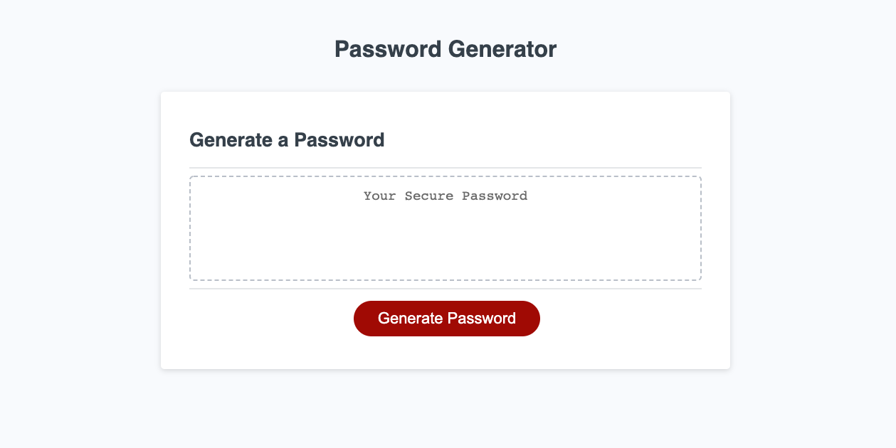
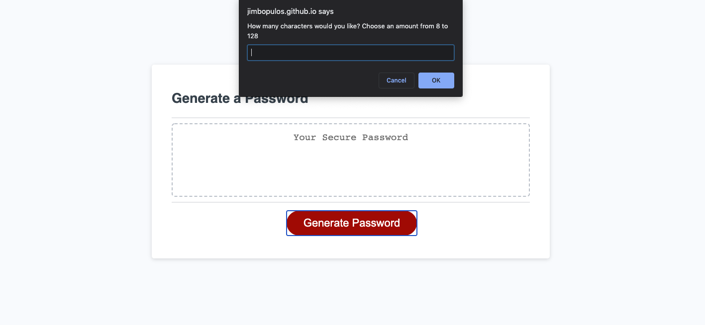
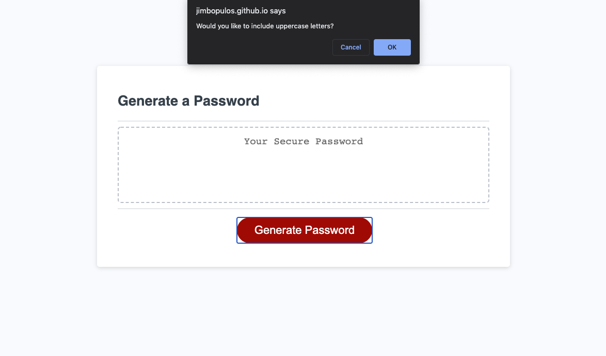
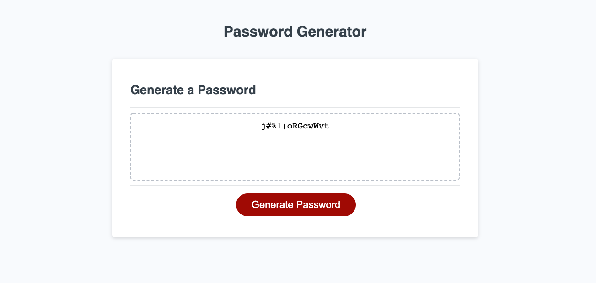

# Password Generator - Get a random & secure password

Employees that handle sensitive data and work on public networks at a startup company need secure passwords to prevent important information from being stolen. In order to ensure the employees and their accounts on the network are more secure, they have been recommended to use a password generator. The more random, the better.

Using JavaScript, we developed code to administer a completely random password based on several fields that the users themselves may choose from. These options, or fields, include: lowercase letters, uppercase letters, symbols and special characters, as well as numbers. We needed them to have the option to choose any one, several, or all fields and then provide them with a randomized password, based on their preference of characters.

- JavaScript
- HTML
- CSS

- Try it yourself [here](https://jimbopulos.github.io/random-password-generator/)
